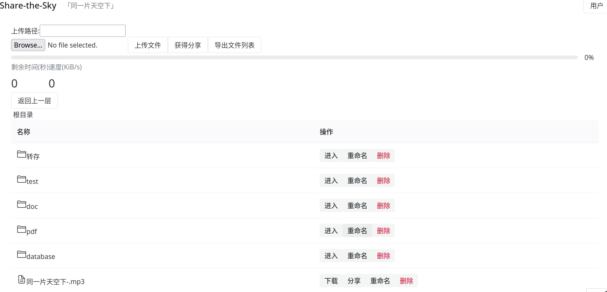

# Share-the-Sky
A file-sharing system with a name inspired by Leah Dou‘s「同一片天空下」

Using [drogon](https://github.com/drogonframework/drogon) that is a C++17/20 based HTTP application framework as the back end. And the [front end](https://github.com/wang29a/Share-the-Sky-frontend) is Vue3.

## Project Preview



## Functions
1. Upload and Download files.
2. Share files with others.
3. Export files information.
4. Get information of users and files.**(Admin)**
5. Modify user information and delete files. **(Admin)**

## Project Setup
### Config
You should move `./examples/config.json` to `./config.json` and modify your password of database.
And you can config more details on config.json, such as the maximun of file and the port of database.
   
### install back end with docker
```sh
docker pull drogonframework/drogon
docker pull mariadb
docker network create cloud
docker run -d --network cloud -v /real/path/to/mariadb:/var/lib/mysql  -e MYSQL_ROOT_PASSWORD=your-password -it -p 3306:3306 mariadb:latest
docker exec -it the-id-of-mariadb mariadb -u root -p
```
### confirm the ip of database
```sh
docker ps
docker inspect the-id-of-mariadb
```
Make sure that the IPAddress is equal to the host of db_clients in config.json.
### set up database
```sql
CREATE TABLE drogon.fileOfUser (
userId INT NOT NULL,
fileId INT NOT NULL,`path` varchar(100) NOT NULL,fileName varchar(100) NOT NULL,
`time` DATETIME NOT NULL,fileSize INT NOT NULL, folderId int not null,
CONSTRAINT fileOfUser_PK PRIMARY KEY (userId,fileId)
)
ENGINE=InnoDB
DEFAULT CHARSET=utf8mb4
COLLATE=utf8mb4_general_ci;


CREATE TABLE drogon.share (shareId INT auto_increment NOT NULL,
userId INT NOT NULL,
fileId INT NOT NULL,
`time` DATETIME NOT NULL, code varchar(10) NOT NULL,
CONSTRAINT share_PK PRIMARY KEY (shareId)
)
ENGINE=InnoDB
DEFAULT CHARSET=utf8mb4
COLLATE=utf8mb4_general_ci;


CREATE TABLE drogon.folderOfUser (
folderId INT  NOT NULL,
userId int not null,
CONSTRAINT folderOfUser_PK PRIMARY KEY (folderId, userId)
)
ENGINE=InnoDB
DEFAULT CHARSET=utf8mb4
COLLATE=utf8mb4_general_ci;


CREATE TABLE drogon.file (
    id INT auto_increment NOT NULL,
    MD5 varchar(100) NOT NULL,
    fileExtension varchar(100) NOT NULL,
    CONSTRAINT file_PK PRIMARY KEY (id)
)
ENGINE=InnoDB
DEFAULT CHARSET=utf8mb4
COLLATE=utf8mb4_general_ci;


CREATE TABLE drogon.`user` (
id INT auto_increment NOT NULL,
userName varchar(100) NOT NULL,
passWord varchar(100) NOT NULL,
permissions INT NOT NULL,
capacity DOUBLE NOT NULL,
remaining DOUBLE NOT NULL,
CONSTRAINT user_PK PRIMARY KEY (id)
)
ENGINE=InnoDB
DEFAULT CHARSET=utf8mb4
COLLATE=utf8mb4_general_ci;


CREATE TABLE drogon.folder (
folderId INT auto_increment NOT NULL,
folderName varchar(100) NOT NULL,
fatherFolderId int not null,
CONSTRAINT folder_PK PRIMARY KEY (folderId)
)
ENGINE=InnoDB
DEFAULT CHARSET=utf8mb4
COLLATE=utf8mb4_general_ci;
```
### [install front end](https://github.com/wang29a/Share-the-Sky-frontend)
### build the project 
```sh
docker run -p 5555:5555 -v /real/path/to/share-the-sky:/data/drogon --network cloud -it drogonframework/drogon
cd /data/drogon/relative/path/to/project/build
cmake ..
./stk
```
### visit share-the-sky
```js
http://localhost:8080/login
see more ip and port on front end
```
## Todo
- [ ] breakpoint transmission
   

